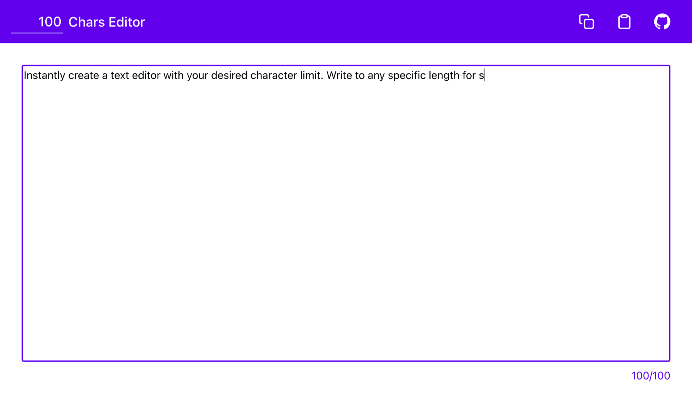

# N Chars Editor

This is a simple web-based text editor that I created to help you write text with a specific character limit. I often need to write software descriptions, app store listings, headlines, and other text content where the length is constrained, so I built this tool to make that process easier. It's a "Hello World" style application, meaning it's intentionally simple and built with basic web technologies.

It also can be a learning resource for those new to web development. The code is written in plain HTML, CSS, and JavaScript, with no external libraries or frameworks. I've also added comments throughout the (although very simple) HTML, CSS, and JavaScript code to explain how it works.

You can find the live version of the editor at [nchars.thehelloworldwriter.com](https://nchars.thehelloworldwriter.com/).



## Features

*   **Custom Character Limit**: Set any character limit for your text.
*   **Real-time Counter**: See your character count update as you type.
*   **Clipboard Actions**: Easily copy your text to the clipboard or paste content into the editor.
*   **Responsive Design**: Works on various screen sizes.
*   **Zero Dependencies**: No frameworks or libraries are used.

## Technical Overview

This project is built with vanilla HTML, CSS, and JavaScript. There is no compilation, minification, or any other transformation step. The files are served using GitHub Pages from the `/docs` folder.

The main files are:

*   `docs/index.html`: The main HTML file that defines the structure of the page.
*   `docs/styles/app.css`: The CSS file for styling the application.
*   `docs/scripts/app.js`: The JavaScript file that contains all the application logic.

## Running Locally

To run this project on your local machine, you'll need a simple web server.

1.  Clone this repository:
    ```bash
    git clone https://github.com/TheHelloWorldWriter/n-chars-editor.git
    ```
2.  Navigate to the project directory:
    ```bash
    cd n-chars-editor
    ```
3.  Start a local web server. If you have Python installed, you can run:
    ```bash
    python -m http.server -d docs
    ```
    Or, if you have Node.js installed, you can use the `serve` package:
    ```bash
    npx serve docs
    ```
4.  Open your web browser and go to the address provided by the server (usually `http://localhost:8000`).

## License

This project is licensed under the MIT License - see the [LICENSE](LICENSE) file for details.

## Want to See More?

I'm The Hello World Writer, and I'm passionate about creating simple, useful, and educational open-source projects like this one. I have many more "Hello World" apps and programs that I've created over the years and would love to polish and release to the world.

To help me dedicate more time to this, you can support me by checking out the apps I've published under [Tecdrop](https://www.tecdrop.com/), a brand I founded for my mobile applications. I offer a couple of Pro apps to customize your phone's wallpaper. You can set a perfect, battery-saving pitch-black screen—or explore hundreds of alternatives, from shades of gray to unique, AI-crafted wallpapers. You can also set any solid color imaginable or browse a curated collection of thousands of named colors, featuring everything from historical tones and sophisticated shades to essential basics.

By purchasing one of these [Pro apps](https://www.tecdrop.com/apps/pro/), you're directly helping me create more free and open-source "Hello World" projects. Thank you for your support!

<br>
<a href="https://www.tecdrop.com/">
  
</a>
